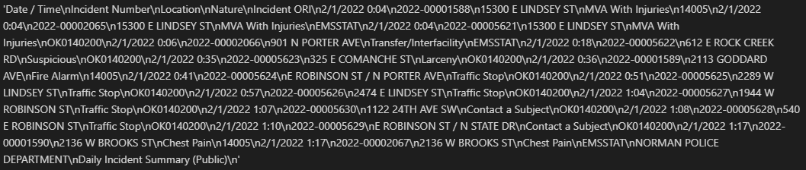
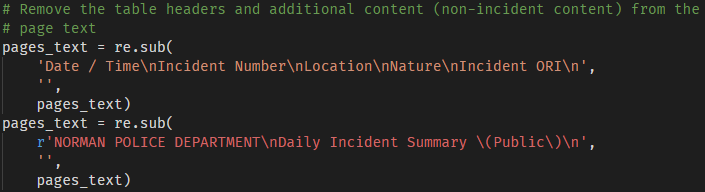
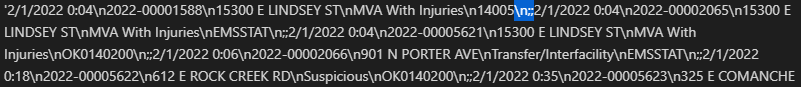

# Documentation
This file include explanation about the extraction algorithm and how the algorithm is implemented in python. A sample MVP implementation of this algorithm is located [here](../notebooks/MVP.ipynb).

## Overview
> See [Run on local system](../README.md) to run this project locally.

This utility takes the Incident PDF file URL as the input and returns the summary of Incident Nature found and their counts from the given PDF. The extraction process is as follows.

Explanation about each module can be found later down the document (or follow the below quick links).
- [Downloader](#downloader)
- [Parser](#parser)

## Downloader
[`downloder.py`](../project0/downloader.py) contains the code to perform the following tasks.
1. Download the Incidents PDF from the given URL into a temporary file and
2. Extract the Incidents data (as unparsed string) from the temporary file.

This file contains the following funtions.
- [fetch_incidents](#fetchincidentsurl---list)
- [extract_incidents](#extractincidentstempfile---list)

### fetch_incidents(url) -> list
This function used built-in `urllib` to reach out to the given resource URL and tries to get the resource as bytes. Then we store the bytes in a temporary file created using built-in `tempfile` package.

There is a possibility of supplying invalid URL to the utility. In doing so `urllib` raises an exception from [utllib.error](https://docs.python.org/3/library/urllib.error.html#module-urllib.error) or [ValueError](https://docs.python.org/3/library/exceptions.html#ValueError) exception if the URL has invalid schema (http protocol).

### extract_incidents(temp_file) -> list
The above function `fetch_incidents` depends on `extract_incidents` to create a unparsed 2-dimentional list containing incidents from each page using python's built-in `re` package and third-party `PyPDF2` package. This function performs the following tasks.

1. Read page content using `PyPDF2` and create an unparsed, unformatted string.

    
2. There is some content which is not incident data (like table headers, PDF titles). The function uses `re` to remove those unwanted content using `re.sub`.

    
3. Later, using `re.sub` the utility add a row sperator `\n;;` between each row.

    
4. Finally, the utitlity uses `re.findall` to extract all rows from the file using two seperate regular expressions which used the special row seperator `\n;;`.
    * Extracts all rows with either all 5 columns present or 4 columns present using `(\d+/\d+/\d{4}.\d+:\d\d)\n(\d{4}-\d{8})\n([\w,\.;#\'<>&\(\) /-]*)\n([\w /]*)\n([\w /]*)\n;;`
    * Extracts rows with location and nature column data missing using `(\d+/\d+/\d{4}.\d+:\d\d)\n(\d{4}-\d{8})()()\n([\w /]*)\n;;`

#### Regular expressions explanation
Each row of incident contains Date Time, Incident Number, Location, Incident Nature and Incident ORI. Each column of the row have unique characteristics based on which the above regular expression was derived. Those characteristics are as follows.

| Column Name  | Regular Expression  | Example Values | Comment |
|-----------|----------|-------------|-------------|
|Date Time|`\d+/\d+/\d{4}.\d+:\d\d`|2/1/2022 0:04|Fixed datetime format|
|Incident Number|`\d{4}-\d{8}`|2022-00001588|Fixed format|
|Location|`[\w,\.;#\'<>&\(\) /-]*`|2113 GODDARD AVE, W MAIN ST / 24TH AVE SW, 35.2046561833333;-97.4720664|Contains numbers, alphabets (uppercase), space and special characters (including `,.;#<>'&()-`). This [Sample File](../tests/resources/sample.pdf) contains some such possible special characters|
|Nature|`[\w /]*`|Traffic Stop, Disturbance/Domestic |Contains alphabets (lowercase and uppercase) along with space and slash (`/`) special character|
|Incident ORI|`[\w /]*`|OK0140200, EMSSTAT, 14005|Contains alphabets (uppercase) and numbers|

## Parser
[`parser.py`](../project0/parser.py) converts the 2-dimentional list of incident data into `Incident` python class, which is used later down the extraction process.

This file contains the following funtions.
- [extract_incidents](#extractincidentsrawincidents---listincident)

### extract_incidents(raw_incidents) -> list[Incident]
This function goes through each raw incident in the `raw_incidents` and create an `Incident` object. Which is stored in a list to be returned along with other parsed incidents

## Storer
[`storer.py`](../project0/storer.py) contains the code to perform the following functionality.
1. Abstracts the database fucntionality of creating, adding and retrieving incident data and
2. Create the database abstraction

This file contains the following class and funtions.
- [NormanPdDb](#class-normanpddb-database-abstraction)

### class NormanPdDb (Database Abstraction)
This class acts a the database layer for this utility. This abstraction used built-in `sqlite3` package to interact with the file-based sqlite database. 