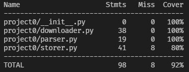

# Testing
This file explans about the unittesting done to this utility using `pytest`. The test coverage for this utility is at `92%`.

Testing is done specific to the three stages of the extraction process.
- [Downloader](#downloder)
- [Parser](#parser)
- [Storer](#storer)

## Downloder
[`test_downloader.py`](../tests/test_downloader.py) contains the testcases for download functionality of this utility.

The file consists of the following tests and fixtures.
- [sample_file](#sample_file)
- [sample_file_df](#sample_file_df)
- [test_fetch_incidents_should_return_unparsed_data_for_valid_url](#test_fetch_incidents_should_return_unparsed_data_for_valid_url)
- [test_fetch_incidents_should_return_nothing_for_invalid_url](#test_fetch_incidents_should_return_nothing_for_invalid_url)
- [test_extract_incidents_should_return_nothing_for_invalid_file](#test_extract_incidents_should_return_nothing_for_invalid_file)
- [test_extract_incidents_should_return_data_as_list_for_valid_file](#test_extract_incidents_should_return_data_as_list_for_valid_file)

### sample_file()
sample_file is a fixture. This fixture returns the contents of the [Sample File](../tests/resources/sample.pdf) as an `io.BytesIO` class, simulating the output from `PyPDF2` package. This sample file is a custom made PDF file which contains almost all special cases of rows present in real incidents files. This custom PDF file is used to test the satisfiability of all possible edge cases.

### sample_file_df()
sample_file_df is a fixture as well. This fixture returns a `Pandas Dataframe` containing the data from a [Sample CSV file](../tests/resources/sample_output.csv) which contains the actual data extracted from the [Sample file](../tests/resources/sample.pdf). This DataFrame is used to test the effectiveness of the incidents extraction algorithm.

### test_fetch_incidents_should_return_unparsed_data_for_valid_url()
This test simply calls `downloader.fetch_incidents` to check if the utility can reach out to the valid Norman PD website, get the PDF and extract incidents from it.

### test_fetch_incidents_should_return_nothing_for_invalid_url()
This test calls `downloader.fetch_incidents` with an invalid URL to verify that the function returns None, indicating the URL is invalid.

### test_extract_incidents_should_return_data_as_list_for_valid_file()
`downloader.extract_incidents` is tested in this function. An input containing the `IO[bytes]` type data of the sample PDF is sent to the function and assertion is made to the result of the function to check if required number of incidents are returned.

### test_extract_incidents_should_return_nothing_for_invalid_file()
Similar to the above test, `downloader.extract_incidents` is tested in this test aswell. But the input data sent is invalid. Thus assertion is made to check if the returned value is `None`.

## Parser
[`test_parser.py`](../tests/test_parser.py) tests the functionalities used to convert unparsed 2-dimentional incidents data to parsed list of incidents.

The file consists of the following tests and fixtures.
- [sample_unparsed_incidents](#sample_unparsed_incidents)
- [test_extract_incidents_should_return_a_list](#test_extract_incidents_should_return_a_list)
- [test_incident_class](#test_incident_class)

### sample_unparsed_incidents
sample_unparsed_incidents is a fixture, which returns a list of 6 sample incidents. The output of this fixture simulates an output of `downloader.fetch_incidents` so the functions further down the extraction pipeline can be tested.

### test_extract_incidents_should_return_a_list
This test if `parser.extract_incidents` accepts a 2-dimentional list of raw incidents and returns a list of Incident class objects. Assertions based on the input and output length and thanks to `__eq__()` method in Incident class, `==` assertions between actual and expected Incident object are also made.

### test_incident_class
This function tests the over all functionality of `parser.Incident` class. Thus methods like `__repr__()`, `__str__()` and `__eq__()` are tested in this test function.

## Storer
[`test_storer.py`](../tests/test_storer.py) tests the functionalities used to create, save and retrieve incidents from sqlite3 database.

The file consists of the following tests and fixtures.
- [db](#db)
- [sample_incidents](#sample_incidents)
- [test_create_db_should_return_connectable_db](#test_create_db_should_return_connectable_db)
- [test_get_stats_should_return_formatted_natures_count_string](#test_get_stats_should_return_formatted_natures_count_string)

### db
db is a module level fixture, which is used to setup the database for some tests to be run on it and teardown the database after the tests are completed. A database with the name `test_normanpd.db` is created and deleted after each test in this file.

### sample_incidents
sample_incidents is a fixturem, which returns a list of `parser.Incident` type objects simulating the output from the parser module.

### test_create_db_should_return_connectable_db
This test if the database was successfully created or not. This is done using the `Normanpddb.check_con()` function.

### test_get_stats_should_return_formatted_natures_count_string
This test checks if incidents are added to the database using `Normanpddb.add_incidents()` and the appropriate output is generated with nature and nature count using `Normanpddb.get_stats()`